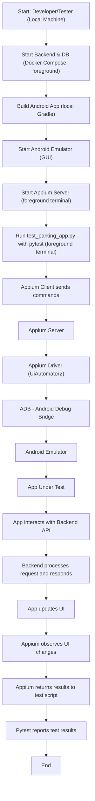

# Android Emulator Runner: GitHub Action Summary

The **Android Emulator Runner** is a GitHub Action that simplifies setting up and running hardware‑accelerated Android emulators on Linux and macOS virtual machines. It is especially useful for CI environments where configuring emulators and virtualization can be complex.

**Key Features:**

- **Hardware‑Accelerated Emulators:** Automatically installs and configures GPU and VM acceleration for fast x86/x86_64 Android emulators, even in CI environments.
- **Automated Lifecycle:** Handles Android SDK setup, AVD creation, emulator boot, readiness checks, test execution (e.g., `./gradlew connectedCheck`), and teardown—all in one step.

**Basic Usage Example:**

```yaml
- name: Enable KVM
  run: |
    echo 'KERNEL=="kvm", GROUP="kvm", MODE="0666", OPTIONS+="static_node=kvm"' \
      | sudo tee /etc/udev/rules.d/99-kvm4all.rules
    sudo udevadm control --reload-rules
    sudo udevadm trigger --name-match=kvm

- name: Run Android emulator and tests
  uses: reactivecircus/android-emulator-runner@v2
  with:
    api-level: 29
    script: ./gradlew connectedCheck
```

- **Enable KVM** (on Linux runners) to allow VM acceleration.
- Use the Action at a specified version (e.g., `@v2`).
- Set `api-level` to the desired Android API level (e.g., 29).
- Set `script` to the command to execute once the emulator is ready.

---

## Project Structure: Modules & Submodules in GitHub

This repository is organized into several top-level modules and submodules, some of which may be managed as Git submodules for separation of concerns and easier maintenance. Each module serves a distinct purpose in the overall project:

- **Android-App-for-Car-Parking-Project/**
  - Android mobile application source code, build scripts, and configuration files.
  - Contains the main app code in `app/`, Gradle build files, and code style/linting configs.
  - Includes end-to-end test scripts and supporting files for building and running the Android app.
  - May be included as a submodule if developed independently.

- **Backend-Implementation-for-Car-Parking-Project/**
  - Backend server implementation (Python/Flask), Docker setup, and database backup.
  - Contains `app.py`, `run.py`, and test scripts for backend API.
  - Includes Docker Compose files for local development and testing.
  - May be included as a submodule for modular backend development.

- **tests/**
  - Python-based end-to-end and integration tests for the parking app.
  - Contains `test_parking_app.py` and related requirements.
  - May be managed as a separate submodule for test automation.

- **bin/**
  - (If present) Utility scripts or binaries for project setup or automation.

> **Note:** If you clone this repository and see empty directories for any of the above, you may need to initialize and update submodules with:
>
> ```bash
> git submodule update --init --recursive
> ```
>
> **Common submodule commands:**
>
> - Add a submodule:
>   ```bash
>   git submodule add <repository-url> <path>
>   ```
> - Update all submodules:
>   ```bash
>   git submodule update --remote --merge
>   ```
> - Remove a submodule:
>   ```bash
>   git submodule deinit -f <path>
>   git rm -f <path>
>   rm -rf .git/modules/<path>
>   ```

---

## Project Integration Test Workflow (Local Machine, Foreground Mode)



---

This flowchart shows the full workflow for running integration tests using `test_parking_app.py` on a **local machine in foreground mode** (not CI/headless). The backend and database are started and managed using **Docker Compose** in a terminal. The Android emulator is started locally with a GUI, and both the Appium server and test runner are run in foreground terminals. Each step represents a key part of the stack: backend, database, Android app, emulator, Appium, and test execution. For more on Mermaid diagrams in Markdown, see [Mermaid documentation](https://mermaid.js.org) and [this DEV article](https://dev.to/farisdurrani/draw-diagrams-in-readmes-using-mermaid-1c49).